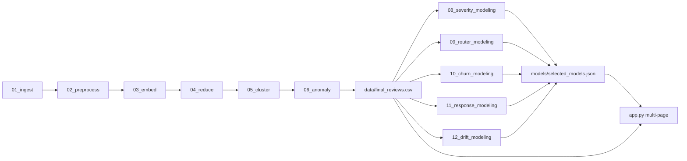

# Complaint Intelligence Engine Upgrade Plan

## Scope and Outcome
Build an upgraded, end-to-end ML application that:
- trains and compares multiple models per task,
- evaluates and selects best models with clear metrics,
- serves actionable predictions in Streamlit for real e-commerce operations.

Primary tasks (per your direction): severity + category routing + churn risk + auto-response quality scoring + topic drift detection.

## Current Baseline (What We Reuse)
- Pipeline orchestrator: [`d:/Users/Devika Jonjale/RD Project/Complaint-Intelligence-Engine-for-Indian-E-Commerce/run_pipeline.py`](d:/Users/Devika Jonjale/RD%20Project/Complaint-Intelligence-Engine-for-Indian-E-Commerce/run_pipeline.py)
- Current Streamlit app: [`d:/Users/Devika Jonjale/RD Project/Complaint-Intelligence-Engine-for-Indian-E-Commerce/app.py`](d:/Users/Devika Jonjale/RD%20Project/Complaint-Intelligence-Engine-for-Indian-E-Commerce/app.py)
- Extension design guidance source: [`d:/Users/Devika Jonjale/RD Project/Complaint-Intelligence-Engine-for-Indian-E-Commerce/CIE_Extension_Modules_Full_Guide.pdf`](d:/Users/Devika Jonjale/RD%20Project/Complaint-Intelligence-Engine-for-Indian-E-Commerce/CIE_Extension_Modules_Full_Guide.pdf)

## Target Architecture

## Implementation Plan

### 1) Add supervised extension pipeline stages
Create new scripts and integrate them into [`run_pipeline.py`](d:/Users/Devika Jonjale/RD%20Project/Complaint-Intelligence-Engine-for-Indian-E-Commerce/run_pipeline.py):
- `08_severity_modeling.py`
- `09_router_modeling.py`
- `10_churn_modeling.py`
- `11_response_modeling.py`
- `12_drift_modeling.py`

Each stage will produce:
- feature-ready datasets in `data/`;
- trained candidate models in `models/`;
- `metrics_*.csv/json` comparison outputs in `reports/`;
- one selected production model artifact + metadata.

### 2) Build training-label strategy for quality
Use hybrid labeling (high quality under limited manual effort):
- Weak labels from rules/heuristics (as suggested in your PDF),
- Confidence filtering and noise reduction,
- Small manually reviewed gold set for final evaluation.

This supports both speed and trustworthiness for “best model” selection.

### 3) Model benchmarking framework (common across modules)
Add reusable evaluation utilities in a new module (e.g. `ml_utils/`):
- common train/validation/test splits,
- class-imbalance handling,
- per-model latency measurement,
- standardized comparison tables,
- selected-model registry writer (`models/selected_models.json`).

Selection policy:
- Severity: weighted F1 + calibration,
- Routing: macro-F1,
- Churn: PR-AUC + recall at top-k,
- Auto-response quality: quality score + safety checks,
- Drift: detection precision/recall against pseudo-events.

### 4) Module-specific design
- **Severity triage**: predict Low/Medium/High + risk score; candidate models include logistic regression, random forest, linear SVM, gradient boosting/xgboost (if added), optional lightweight transformer baseline.
- **Complaint router**: convert cluster knowledge into supervised routing categories; compare TF-IDF vs embeddings vs combined features.
- **Churn risk**: derive churn proxy labels from repeated complaints/time patterns and complaint severity trajectory; produce user/platform risk boards.
- **Auto-response generator with quality score**: retrieval/template + LLM-style generation fallback (if API unavailable, keep deterministic template mode); score responses for relevance, tone, actionability, and policy safety.
- **Topic drift detector**: weekly embedding-distribution shift (e.g., centroid shift + population stability index + Jensen-Shannon divergence proxy) with alert thresholds.

### 5) Upgrade Streamlit into decision support app
Refactor [`app.py`](d:/Users/Devika Jonjale/RD%20Project/Complaint-Intelligence-Engine-for-Indian-E-Commerce/app.py) into multi-page navigation:
- Keep existing 4 base pages,
- Add pages for Severity, Router, Churn, Auto-Responder, Drift,
- Add model-comparison panels showing candidate metrics and selected model rationale,
- Add “what changed” operational insights (weekly trend deltas, top drivers).

### 6) Real-world operations layer
Add outputs stakeholders can act on:
- queue prioritization table (high severity first),
- team routing load dashboard,
- churn-risk watchlist,
- response recommendation panel with quality score,
- drift alert digest for weekly review.

### 7) Documentation and reproducibility
- Update README with new pipeline steps and module outputs,
- Add a concise methodology and evaluation section,
- Add `reports/model_selection_summary.md` for final chosen models,
- Ensure one-command execution still works via `run_pipeline.py`.

## Deliverables
- New module scripts (`08` to `12`) integrated in pipeline.
- Candidate-model comparison reports for each module.
- Selected production models + registry.
- Upgraded Streamlit app with expanded pages and operational workflows.
- Updated documentation and run instructions.

## Risks and Mitigations
- **Weak-label noise**: mitigate using confidence filters + small gold validation set.
- **Class imbalance**: use weighted losses / resampling and report per-class metrics.
- **Latency in demo**: preload models and cache inference.
- **Dependency bloat**: keep optional heavy models behind feature flags.
