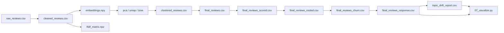
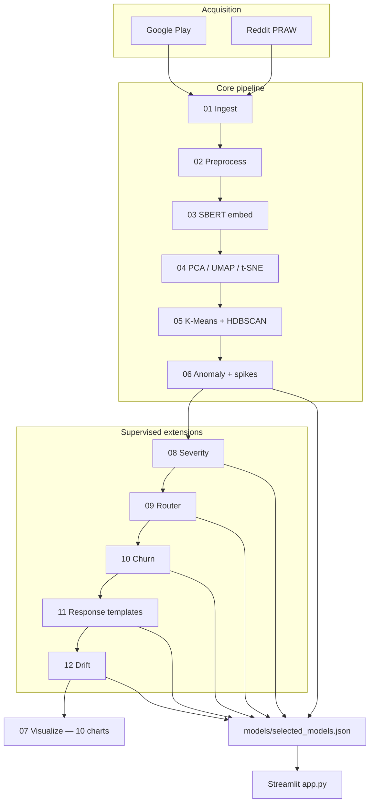
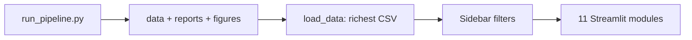

# Complaint Intelligence Engine — Comprehensive Project Summary

This document is the **authoritative project overview**: objectives, **data**, **architecture**, **hypotheses**, **statistical and evaluation methodology**, **ML models and metrics**, **illustrative results** (from a completed pipeline run; your numbers will vary after `python run_pipeline.py`), limitations, and conclusions. It aligns with the repository (`README.md`, `PROJECT_REPORT.md`, pipeline scripts `01`–`12`, `run_pipeline.py`, `ml_utils.py`, `ml_evaluation_plots.py`, `07_visualize.py`, `app.py`, and `reports/`).

---

## 1. Abstract and objectives

The **Complaint Intelligence Engine** is an end-to-end pipeline and **Streamlit** dashboard for **Indian e-commerce complaints** (primarily **Google Play** reviews; optional **Reddit**). It:

- Ingests and cleans **multilingual** text (including **Hinglish**).
- Builds **TF-IDF** and **multilingual Sentence-BERT** representations.
- Discovers **themes** (clustering), **anomalies**, and **weekly volume spikes**.
- Trains and compares **supervised** models for **severity**, **routing**, **churn risk**, **response templates**, and **topic drift** summaries.
- Exports **tables**, **static figures** (`figures/viz_*.png`), and **ML benchmark plots** (`reports/ml_figures/`).

**Primary objective:** Support **operations and CX** with a repeatable workflow—**prioritisation**, **team routing**, **retention risk surfacing**, and **early detection of shifting complaint topics**—without requiring manual reading of entire review streams.

---

## 2. Problem statement

| Challenge | Project response |
|-----------|------------------|
| High volume, noisy text | Cleaning, deduplication, structured features |
| English / Hinglish mix | `langdetect`, multilingual embeddings |
| Unknown issue taxonomy | Unsupervised **K-Means** + **HDBSCAN** on UMAP space |
| Rare / severe incidents | **Isolation Forest** + HDBSCAN noise → **Tier 1** |
| Sudden operational stress | **Rolling z-score** on weekly counts per platform × cluster |
| Action routing | Supervised **router** (TF-IDF + linear / ensemble models) |
| Escalation priority | **Severity** models on weak labels + dense features |
| Churn signalling | **Binary** models on a **proxy** “at-risk” label |
| Response drafting | Compared **template generators** + heuristic **quality** scores |
| Emerging topics | **Centroid shift** + **Jensen–Shannon** divergence week-on-week |

**Engineering success criterion:** `python run_pipeline.py` completes and materialises `data/`, `models/`, `reports/`, `figures/`, and `reports/ml_figures/` for the dashboard.

---

## 3. Data: sources, schema, and scale

### 3.1 Sources and ingestion parameters

| Source | Mechanism | Configuration (code) |
|--------|-----------|-------------------------|
| **Google Play** | `google-play-scraper` | Apps: Myntra, Meesho, Nykaa, Flipkart, Amazon India; `en` + `hi`; `country=in`; up to **500** reviews per app per language; newest first (`01_ingest.py`) |
| **Reddit** | `praw` + `python-dotenv` | Subreddits e.g. `IndianShopping`, `Meesho`, `india`; keyword filter; limit **200**; requires `.env` credentials |

### 3.2 Documented run (`PROJECT_REPORT.md`)

These figures are **example** counts from one execution; live runs differ.

| Stage | Value |
|-------|--------|
| Play Store rows fetched | 4,768 |
| Reddit | Failed (401) without credentials |
| After merge + clean | 2,389 |
| After preprocess + dedup | 2,253 |
| Hinglish-flagged reviews | 196 (~8.7%) |
| TF-IDF matrix | 2,253 × 2,642 |
| Embedding tensor | (2,253, 384); model `paraphrase-multilingual-MiniLM-L12-v2` |
| PCA(50) cumulative explained variance | ~0.80 |
| Chosen K-Means **k** | Data-driven (max **silhouette** on UMAP-10); reported example **k = 4** |
| K-Means vs HDBSCAN **ARI** | Example **0.6748** |

### 3.3 Key derived fields (non-exhaustive)

| Category | Fields (typical) |
|----------|------------------|
| Identity / context | `platform`, `source`, `lang`, `at`, `score`, `thumbs_up`, `content`, `review_length` |
| Text NLP | `cleaned_content`, `text_for_model`, `is_hinglish`, TF-IDF sparse matrix + vocab |
| Geometry | `embeddings.npy`, `pca_50`, `umap_10`, `tsne_2d`, `umap_1`…`umap_10` in tabular exports |
| Clustering | `kmeans_cluster`, `cluster_name`, `hdbscan_cluster`, `hdbscan_is_noise` |
| Anomaly / ops | `isolation_score`, `isolation_anomaly`, `ocsvm_score`, `tier1_critical`, `severity` |
| Supervised | `severity_label_ml`, `severity_score_ml`, `route_category`, `route_confidence`, `churn_risk_score`, `suggested_response`, `response_quality_score` |
| Drift | `topic_drift_report.csv`: `centroid_shift`, `js_divergence`, `shift_z`, `js_z`, `is_drift_alert` |

### 3.4 Data lineage (artefact chain)

---

## 4. Architecture and pipeline order

**Important:** `run_pipeline.py` runs **`07_visualize.py` after `12_drift_modeling.py`** so figures can use the **richest** CSV (`final_reviews_response.csv` when present).

### 4.1 Dashboard data flow

---

## 5. Research and operational hypotheses

The codebase does **not** register formal null hypotheses or *p*-values everywhere; it **operationalises questions** below. Where a **threshold** or **metric** is used, the summary states whether it is a **classical test**, a **heuristic rule**, or a **model-evaluation metric**.

| ID | Hypothesis (plain language) | How the project addresses it | Nature of evidence |
|----|----------------------------|------------------------------|--------------------|
| **H1** | Complaints form **separable themes** in a low-dimensional manifold of embeddings. | K-Means on UMAP-10; **silhouette score** maximised over **k ∈ [3,12]** (`k_selection.csv`). | **Internal cluster validity** (descriptive optimisation), not a significance test. |
| **H2** | Density-based clustering **agrees partly** with partition-based clustering on the same space. | **Adjusted Rand Index (ARI)** between K-Means and HDBSCAN labels. | **Agreement index** [−1,1]; descriptive comparison. |
| **H3** | A small fraction of reviews are **multivariate outliers** in UMAP feature space. | **Isolation Forest** (`contamination=0.05`); top fraction flagged by decision function. | **Unsupervised anomaly scoring**; threshold set by algorithm hyperparameter, not *p*-value. |
| **H4** | **Tier-1** cases are those that are both **isolation outliers** and **HDBSCAN noise**. | `tier1_critical = isolation_anomaly & hdbscan_is_noise`. | **Rule composition** of two detectors. |
| **H5** | For some apps, **“positive experience”** reviews occupy a region usable as **One-Class SVM** reference. | OCSVM trained on rows with `cluster_name` containing `"Positive"` if **≥ 20** rows; else fallback defaults. | **One-class learning**; not a two-sample hypothesis test. |
| **H6** | Weekly complaint counts, **conditional** on platform and cluster, sometimes **exceed typical short-run variation**. | Rolling mean/std over **4 weeks** (min_periods 2); **z-score**; `is_spike = (z_score > 2.5)`. | **Standardised deviation from rolling mean**; interpret as **alert rule** (approximate normal tail if counts were Gaussian—**assumption not verified** in code). |
| **H7** | **Week-to-week** changes in embedding centroids and topic mixes are **unusually large** on some weeks. | L2 shift between consecutive weekly SBERT centroids; **Jensen–Shannon** divergence on topic proportion vectors; **z-scores** of `centroid_shift` and `js_divergence` across weeks; alert if **shift_z > 1.5** or **js_z > 1.5**. | **Standardisation vs time-series of weekly metrics**; **empirical threshold** (not a formal multiple-testing correction). |
| **H8** | **Weak supervision** (rule-based severity labels) supports training models that **generalise** on a held-out split. | Train/test **stratified** split; multiple classifiers; **multiclass metrics** + **3-fold CV** means/std. | **Predictive evaluation** on proxy labels; risk of **leakage** if features duplicate rules (see §10). |
| **H9** | **Cluster names** (or routes) can be predicted from text with acceptable **macro-F1**. | Router trained on TF-IDF text → multiclass metrics; **macro-F1** selection; centroid-distance filter on training subset. | **Supervised learning metrics**; no NHST. |
| **H10** | A **proxy binary label** captures “churn-like” distress for modelling when user IDs are weak. | Proxy from star bucket + severity / Tier-1 / thumbs / isolation flags; **PR-AUC**, **ROC-AUC**, **Brier**, etc. | **Heuristic label** + ranking metrics; not a causal churn claim. |

---

## 6. Statistical methods, metrics, and tests (detailed)

### 6.1 Unsupervised structure and clustering

| Method | Role | Output / note |
|--------|------|----------------|
| **Silhouette score** (`sklearn.metrics.silhouette_score`) | Chooses **k** for K-Means | Higher = tighter, separated clusters in UMAP-10; **no p-value** |
| **K-Means inertia** | Logged in `k_selection.csv` | Elbow-style descriptive |
| **Adjusted Rand Index** | K-Means vs HDBSCAN | Chance-corrected agreement |
| **HDBSCAN** (`min_cluster_size=30`) | Noise / density clusters | Points labelled **−1** = noise |

### 6.2 Anomaly detection

| Method | Parameters | Interpretation |
|--------|------------|----------------|
| **Isolation Forest** | `contamination=0.05`, `n_estimators=200` | Flags ~5% as anomalies in UMAP-10 space |
| **One-Class SVM** | RBF, `nu=0.05`, trained on “positive” cluster subset if sufficient data | Deviation from “normal” subpopulation |

### 6.3 Spike detection (time series per group)

For each **(platform, cluster_name, week)** series:

\[
z_t = \frac{c_t - \bar{c}_{t,\text{roll}}}{s_{t,\text{roll}} + \varepsilon}
\]

where \(c_t\) is complaint count, \(\bar{c}_{t,\text{roll}}\) and \(s_{t,\text{roll}}\) are **rolling mean and std** over **4** prior weeks (`min_periods=2`). **Spike** if \(z_t > 2.5\).

**Caveat:** This is a **rule-based control chart** style rule, not a formal test with controlled false-positive rate across all series.

### 6.4 Drift detection (week on week)

| Quantity | Definition |
|----------|------------|
| **Centroid shift** | \(\| \bar{e}_{w} - \bar{e}_{w-1} \|\) over SBERT embeddings \(\bar{e}\) per week |
| **JS divergence** | Jensen–Shannon between **topic proportion** vectors \(p\) (prev week) and \(q\) (current week) over route/cluster topic labels |
| **shift_z, js_z** | \((x - \mu) / \sigma\) across **weeks** for each signal |
| **Alert** | `shift_z > 1.5` **or** `js_z > 1.5` |

**Caveat:** Weekly **z** compares a week to the **marginal distribution of weekly values**, not to a parametric null; multiple weeks imply **multiple implicit comparisons** without **Bonferroni** / FDR in code.

### 6.5 Supervised learning — evaluation metrics (`ml_utils.py`)

**Multiclass (severity, router):**

| Metric | Use |
|--------|-----|
| Accuracy, balanced accuracy | Overall / class-balanced view |
| Weighted / macro **F1**, precision, recall | Primary policy: severity **weighted F1**; router **macro F1** |
| Cohen’s **κ** | Agreement with weak labels beyond chance |
| **MCC** | Single scalar correlation for multiclass |
| **ROC-AUC OVR** (weighted), **log loss**, Brier-like | Probabilistic quality where `predict_proba` exists |
| **3-fold stratified CV** | `f1_weighted`, `f1_macro` mean ± std on training fold |

**Binary (churn proxy):**

| Metric | Use |
|--------|-----|
| F1, precision, recall, specificity | Threshold 0.5 on predicted probability |
| **PR-AUC**, **ROC-AUC** | Imbalance-aware ranking (**PR-AUC** primary for selection) |
| **Brier score** | Calibration of probabilities |
| **MCC** | Strict summary of confusion matrix |
| **3-fold CV** | `average_precision`, `roc_auc` mean ± std |

**Additional outputs:** `metrics_*_per_class.csv` (severity, router), `metrics_response_scores_long.csv`, PNG charts under `reports/ml_figures/`.

---

## 7. ML models by stage

### 7.1 Severity (`08_severity_modeling.py`)

**Labels:** `severity_label_weak` from rules (legal/financial keywords, stars, thumbs); optional `gold_split` slice for future evaluation.

**Features (anti-leakage):** Tabular inputs are **only** `review_length`, `exclamation_count`, and `capital_ratio` — **not** star rating, thumbs, or regex flags that duplicate the weak-label rules. These are **concatenated with SBERT embeddings** so the model must use semantics, not trivial rule replay.

**Evaluation:** **Group holdout** by `platform` (`GroupShuffleSplit` with stratified fallback) plus **regularised** classifiers (tighter `C`, depth / `min_samples_leaf`, `alpha` on SGD, etc.). The **production** model is **refit on all rows** after selection for full-corpus predictions.

| Candidate model | Notes |
|-----------------|--------|
| LogisticRegression | `class_weight=balanced` |
| RandomForestClassifier | 250 trees, balanced |
| GradientBoostingClassifier | Default-style GBM |
| CalibratedClassifierCV(LinearSVC) | Probabilities for metrics |
| HistGradientBoostingClassifier | Histogram-based boosting |
| Pipeline(StandardScaler + SGDClassifier `loss=log_loss`) | Linear model on scaled dense features |

**Selection:** Best **weighted F1** on stratified **20% holdout**. **Registry:** `models/selected_models.json` → `severity`.

### 7.2 Router (`09_router_modeling.py`)

**Target:** `cluster_name` (factorised). **Input:** `text_for_model` / `cleaned_content`. Optional training filter: embedding distance to cluster centroid ≤ **40th percentile** of distances.

**Evaluation:** **Group holdout** by `platform`; TF-IDF uses **`min_df=2`**, **`sublinear_tf`**, slightly lower `max_features`, and **regularised** linear / tree models. **Production** pipeline is **refit on the full filtered subset** after model selection.

| Model | Vectoriser | Classifier |
|-------|------------|------------|
| logreg_tfidf | TF-IDF 5k, (1,2)-grams | LogisticRegression |
| linear_svc_tfidf | Same | Calibrated LinearSVC |
| rf_tfidf | TF-IDF 3k | RandomForest |
| nb_tfidf | TF-IDF 6k | MultinomialNB |
| extra_trees_tfidf | TF-IDF 4k, (1,2)-grams | ExtraTrees |

**Selection:** Best **macro F1** on holdout. **Artifact:** `router_model.pkl` (pipeline + class list).

### 7.3 Churn proxy (`10_churn_modeling.py`)

**Label (non-leaky):** Complaint-bucket reviews with **star rating ≤ 1** **or** **review length ≥ 80th percentile** (within-batch quantile). **Does not** use `severity_label_ml`, `tier1_critical`, `isolation_anomaly`, or `isolation_score`.

**Features:** `score`, `log1p(thumbs_up)`, `review_length`, `is_hinglish`, `route_confidence` only.

| Model | Notes |
|-------|--------|
| Scaled LogisticRegression | Stronger L2 via lower `C` |
| RandomForest | Shallower trees, larger leaves |
| GradientBoosting | Limited depth, subsample |
| SVC RBF | Lower `C` |
| AdaBoost | Fewer / slower learning |

**Evaluation:** **Group holdout** by `platform`; **selection** by **PR-AUC**; **production refit** on all rows. **Artifact:** `churn_model.pkl`.

### 7.4 Response generators (`11_response_modeling.py`)

**Not** a neural generator: **four** template functions `template_v1`–`v4`; **quality_score** from overlap + empathy/action tokens − toxicity penalty. **Selection:** Highest **mean** quality on a **400-row** sample (configurable via `min(400, n)`).

### 7.5 Drift summary (`12_drift_modeling.py`)

No classifier: **weekly** centroid + JS + z-based **alerts**; summary rows → `metrics_drift.csv` (long format: `metric`, `value`, `kind`).

---

## 8. Illustrative results (one repository snapshot)

> **Disclaimer:** Values below come from **current** `reports/*.csv` and `models/selected_models.json` in the repo **at documentation time**. Re-running the pipeline on new data **will change** all figures. Use these as **examples** of **schema and magnitude**, not fixed benchmarks.

### 8.1 Model registry (`selected_models.json` — example)

| Task | Selected model | Primary metric (registry) |
|------|----------------|---------------------------|
| Severity | `logreg` | weighted F1 = 1.0 |
| Router | `linear_svc_tfidf` | macro F1 ≈ 0.936 |
| Churn | `gradient_boosting` | PR-AUC = 1.0 |
| Response | `template_v3` | mean quality ≈ 0.590 |
| Drift | `weekly_centroid_plus_js` | alert rate ≈ 0.148 |

### 8.2 Severity — holdout + CV (excerpt, `metrics_severity.csv`)

| Model | weighted_f1 | macro_f1 | accuracy | cv_f1_weighted_mean ± std |
|-------|-------------|----------|----------|-----------------------------|
| logreg | 1.0 | 1.0 | 1.0 | 0.999 ± 0.0008 |
| sgd_log | 0.961 | 0.947 | 0.962 | 0.948 ± 0.003 |
| random_forest | 0.951 | 0.767 | 0.955 | 0.942 ± 0.015 |

*Interpretation caution:* Perfect scores for several models strongly suggest **weak-label / feature alignment** or **easy split**; see §10.

### 8.3 Router (excerpt, `metrics_router.csv`)

| Model | macro_f1 | weighted_f1 | accuracy | cv_macro_f1_mean ± std |
|-------|----------|-------------|----------|-------------------------|
| linear_svc_tfidf | 0.936 | 0.938 | 0.939 | 0.933 ± 0.023 |
| logreg_tfidf | 0.928 | 0.927 | 0.927 | 0.915 ± 0.015 |
| nb_tfidf | 0.565 | 0.743 | 0.777 | 0.597 ± 0.011 |

### 8.4 Churn proxy (excerpt, `metrics_churn.csv`)

| Model | pr_auc | roc_auc | f1 | cv_pr_auc_mean ± std |
|-------|--------|---------|-----|----------------------|
| gradient_boosting | 1.0 | 1.0 | 1.0 | 0.997 ± 0.002 |
| svc_rbf | 0.986 | 0.999 | 0.889 | 0.967 ± 0.012 |
| logreg | 0.927 | 0.996 | 0.774 | 0.921 ± 0.013 |

### 8.5 Response templates (`metrics_response.csv` — example)

| Generator | n_samples | avg_quality | std | p90 |
|-----------|-----------|-------------|-----|-----|
| template_v3 | 400 | 0.590 | 0.058 | 0.686 |
| template_v2 | 400 | 0.589 | 0.061 | 0.700 |
| template_v1 | 400 | 0.589 | 0.056 | 0.673 |
| template_v4 | 400 | 0.089 | 0.126 | 0.329 |

*Note:* `template_v4` underperforms on the **current** heuristic—useful as a **sanity check** that scoring differentiates variants.

### 8.6 Drift summary (`metrics_drift.csv` — example)

| metric | value |
|--------|-------|
| weeks_evaluated | 27 |
| drift_alert_weeks | 4 |
| alert_rate | 0.148 |
| mean_centroid_shift | 0.317 |
| mean_js_divergence | 0.054 |
| max_js_divergence | 0.203 |

### 8.7 Hypothesis-linked outcomes (concise)

| Hypothesis | Example quantitative outcome | Caveat |
|------------|------------------------------|--------|
| H1 (themes) | Silhouette-driven **k** stored in `k_selection.csv` | Internal metric only |
| H2 (ARI) | Example ARI **0.67** (`PROJECT_REPORT.md`) | One run |
| H6 (spikes) | Weeks with **z > 2.5** flagged in `spike_report.csv` | Not FDR-controlled |
| H7 (drift) | Example **4 / 27** weeks alerted | Thresholds empirical |
| H8–H10 (ML) | Tables above | Labels proxy / leaky features possible |

---

## 9. Visualisations and reporting

| Output | Description |
|--------|-------------|
| `figures/viz_01_*.png` … `viz_10_*.png` | **Ten distinct** seaborn **darkgrid** charts (numeric + categorical mixes): heatmaps, bars with CI, KDE by group, UMAP scatter, box/violin, stacked %, drift or spike fallback, etc. |
| `reports/ml_figures/*.png` | Model comparison bars, confusion matrices, PR curve (churn), drift timeline, response generator bar/boxplots |
| Streamlit | **Pipeline & ML figures** gallery + per-module **Plotly** bars from metrics CSVs |

---

## 10. Limitations (including inflated ML scores)

| Issue | Detail |
|-------|--------|
| **Weak labels** | Severity targets are still **rule-based**; removing duplicate tabular features and using **group holdout** makes metrics **more honest** but **not** equivalent to human labels. |
| **Residual leakage / shift** | **Group holdout** tests **new platform** generalisation only where platforms split across train/test; **time-based** drift is not fully exercised. |
| **Churn proxy** | Not observed churn; **PR-AUC** reflects the **length / 1-star** heuristic, not true attrition. |
| **Spike / drift z-rules** | **Not** multiple-testing adjusted; Gaussian assumption for counts **unstated**. |
| **OCSVM** | May **degrade** if “positive” cluster is too small (fallback path). |
| **Reddit** | Optional; often absent without credentials. |

**Mitigations:** Time-based validation; human labels; remove rule features from severity inputs; calibration plots; per-class error analysis; frozen evaluation sets.

---

## 11. Technology stack (condensed)

| Layer | Technologies |
|-------|----------------|
| Ingestion | `google-play-scraper`, `praw`, `python-dotenv` |
| Tables / numerics | `pandas`, `numpy`, `scipy` |
| NLP | `langdetect`, `sentence-transformers`, `torch` |
| ML | `scikit-learn`, `umap-learn`, `hdbscan` |
| Viz | `matplotlib`, `seaborn`, `plotly` |
| App | `streamlit`, `joblib` |

---

## 12. Streamlit modules (sidebar)

| Module | Role |
|--------|------|
| How to Use This App | Guided tour |
| Live Pulse | KPIs + volume by cluster |
| Complaint Landscape | t-SNE map |
| Spike Tracker | Weekly lines + spike markers |
| Critical Alerts | Tier 1 table |
| Severity Triage | Scores + metrics/charts |
| Complaint Router | Predict + load histogram + metrics/charts |
| Churn Risk | Histogram + watchlist + metrics/charts |
| Auto-Responder | Live templates + pipeline metrics/charts |
| Drift Monitor | Plotly lines + drift table + summary metrics/charts |
| Pipeline & ML figures | Full gallery of `viz_*` and `ml_figures` |

---

## 13. Future scope and audience

**Future:** Human annotation, time-split benchmarks, production APIs, LLM responses with guardrails, MLOps, multi-channel ingest.

**Audience:** CX leads, product/ops, ML engineers, students.

---

## 14. Conclusion

The Complaint Intelligence Engine combines **unsupervised discovery**, **rule- and model-based risk scoring**, and **supervised multiclass/binary learning** with **explicit weekly statistics** (rolling z-scores, JS divergence, standardised drift scores). It **operationalises** a set of **operational hypotheses** (H1–H10) through **metrics and thresholds**; only some of these are **classical statistical tests**, while others are **information-theoretic**, **algorithmic**, or **machine-learning evaluation** measures.

Treat **reported ML accuracy** as **diagnostic of the current weak labels and split**, not as guaranteed production performance, until **independent validation** is added.

---

## 15. Repository map

| Path | Role |
|------|------|
| `01_ingest.py` … `12_drift_modeling.py`, `07_visualize.py` | Stages |
| `run_pipeline.py` | Order: … `12` then `07` |
| `ml_utils.py`, `ml_evaluation_plots.py` | Metrics + figure helpers |
| `app.py` | Dashboard |
| `data/`, `models/`, `reports/`, `figures/`, `reports/ml_figures/` | Artefacts |
| `README.md`, `PROJECT_REPORT.md` | Setup and run notes |

---

*Regenerate all metrics and figures with `python run_pipeline.py` after code or data changes.*
