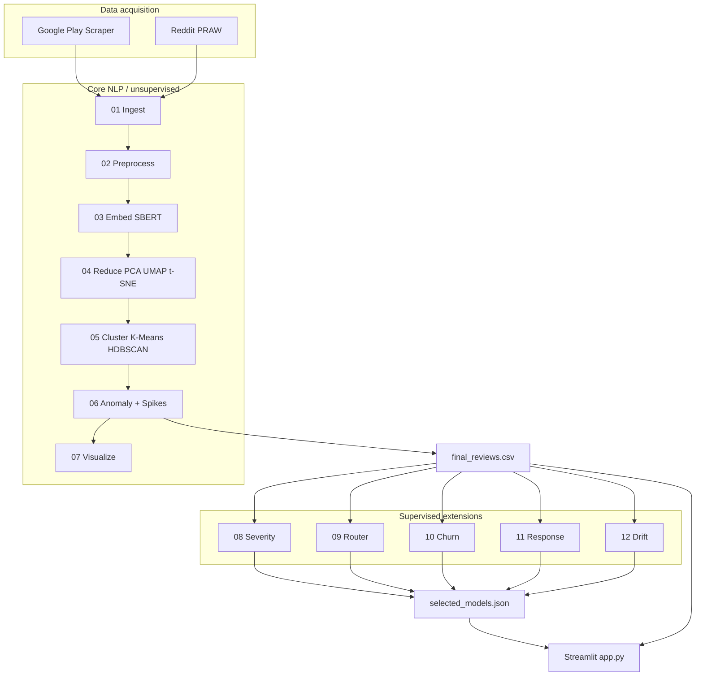
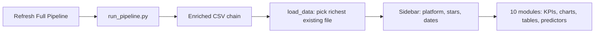

# Complaint Intelligence Engine — Comprehensive Project Summary

This document consolidates the project’s objectives, data, methodology, architecture, technology stack, Streamlit application usage, limitations (including evaluation caveats), mitigations, future scope, audience, and conclusions. It is grounded in the repository (`README.md`, `PROJECT_REPORT.md`, pipeline scripts, `app.py`, `ml_utils.py`, and report artifacts).

---

## 1. Abstract / Objective

The **Complaint Intelligence Engine** is an end-to-end analytics and ML pipeline for **Indian e-commerce complaints** scraped from **Google Play** (and optionally **Reddit**). It turns raw reviews into **clusters, risk signals, supervised scores (severity, routing, churn), response drafts, and topic-drift monitoring**, and exposes everything in a **10-module Streamlit** decision-support application.

**Objective:** Give operations and customer-experience teams a **repeatable workflow** from data ingestion to **prioritisation, routing, retention risk, and emerging-issue detection**—with multilingual (including **Hinglish**) text handled via embeddings and preprocessing.

---

## 2. Problem Statement / Definition

E-commerce apps receive **high volume, noisy, multilingual** reviews. Manual triage does not scale; teams need:

| Challenge | What the project addresses |
|-----------|----------------------------|
| Volume and noise | Automated cleaning, deduplication, TF-IDF + embeddings |
| Mixed English / Hinglish | `langdetect`, multilingual Sentence-BERT |
| Unknown issue themes | Unsupervised clustering (K-Means, HDBSCAN) |
| Rare / extreme cases | Isolation Forest + HDBSCAN noise → Tier 1 alerts |
| Sudden incidents | Weekly spike detection (rolling z-score) |
| Operational actions | Severity, routing, churn proxy, templates + quality metrics, drift |

**Definition of success (engineering):** One command (`python run_pipeline.py`) produces `data/`, `models/`, `reports/`, and a dashboard that loads the richest available CSV (`final_reviews_response.csv` → … → `final_reviews.csv`).

---

## 3. Dataset Description

### 3.1 Sources

- **Google Play:** Myntra, Meesho, Nykaa, Flipkart, Amazon India (`01_ingest.py`): up to **500 reviews per app per language**, `en` + `hi`, country `in`, newest first.
- **Reddit (optional):** PRAW, subreddits such as `IndianShopping`, `Meesho`, `india`, keyword-filtered posts — requires `.env` credentials (`REDDIT_CLIENT_ID`, `REDDIT_CLIENT_SECRET`).

### 3.2 Reported Run (from `PROJECT_REPORT.md`)

| Stage | Count / detail |
|--------|----------------|
| Google Play fetched | 4,768 |
| Reddit | Failed (401) without credentials |
| After merge + clean | 2,389 |
| After preprocess + dedup | 2,253 |
| Hinglish share | 196 (~8.7%) |
| TF-IDF shape | 2,253 × 2,642 |
| Embeddings | (2,253, 384), model `paraphrase-multilingual-MiniLM-L12-v2` |

### 3.3 Artifacts

`data/raw_reviews.csv` → `cleaned_reviews.csv` → embeddings, reductions, `clustered_reviews.csv`, `final_reviews.csv`, plus extension outputs (`final_reviews_scored.csv`, `final_reviews_routed.csv`, `final_reviews_churn.csv`, `final_reviews_response.csv`, `topic_drift_report.csv`, etc.).

---

## 4. Methodology and Module Explanation

**Orchestration:** `run_pipeline.py` runs scripts **01 → 12** in order.

| Step | Script | Role |
|------|--------|------|
| 01 | `01_ingest.py` | Play Store + Reddit merge → `raw_reviews.csv` |
| 02 | `02_preprocess.py` | Cleaning, features, TF-IDF |
| 03 | `03_embed.py` | Sentence-BERT embeddings |
| 04 | `04_reduce.py` | PCA, UMAP, t-SNE |
| 05 | `05_cluster.py` | K-Means, HDBSCAN, profiles, k selection |
| 06 | `06_anomaly.py` | Isolation Forest, One-Class SVM, Tier 1, spikes |
| 07 | `07_visualize.py` | Static chart exports |
| 08 | `08_severity_modeling.py` | Weak + gold-style labels, tabular + embedding features, model compare → `severity_model.pkl`, `final_reviews_scored.csv` |
| 09 | `09_router_modeling.py` | Supervised routing vs clusters → `router_model.pkl`, routed CSV |
| 10 | `10_churn_modeling.py` | Churn proxy, model comparison |
| 11 | `11_response_modeling.py` | Response generator comparison, quality scores |
| 12 | `12_drift_modeling.py` | Weekly topic drift (centroid + JSD-style signals) |

**Shared logic:** `ml_utils.py` — directories, `update_selected_model`, latency timing, `multiclass_metrics` / `binary_metrics`.

**Selection policy (documented in `reports/model_selection_summary.md`):** severity — weighted F1 (calibration tracked); router — macro F1; churn — PR-AUC; auto-response — average response quality score; drift — weekly centroid + distribution divergence alert framework.

---

## 5. Architecture Workflow (Diagrams)

### 5.1 End-to-End Pipeline

### 5.2 Dashboard Data Flow

---

## 6. Technologies Used — Where, How, and Why

| Technology | Where used | Why |
|------------|------------|-----|
| **Python 3.x** | Entire repository | ML, data processing, UI |
| **google-play-scraper** | `01_ingest.py` | Live Play Store reviews |
| **praw**, **python-dotenv** | `01_ingest.py` | Reddit API + environment secrets |
| **pandas**, **numpy**, **scipy** | All stages | Tabular data, numerics, statistics |
| **langdetect** | Preprocess | Language detection / Hinglish awareness |
| **sentence-transformers**, **torch** | `03_embed.py` | Multilingual semantic vectors |
| **scikit-learn** | Preprocess, reduction, clustering-related steps, supervised models | Standard ML algorithms and metrics |
| **umap-learn**, **hdbscan** | `04_reduce.py`, `05_cluster.py` | Manifold learning, density-based clustering |
| **plotly** | `app.py`, `07_visualize.py` | Interactive charts in the dashboard |
| **matplotlib**, **seaborn** | `07_visualize.py` | Static figure exports |
| **streamlit** | `app.py` | Decision-support dashboard, filters, pipeline trigger |
| **joblib** | Model persistence | `*.pkl` artifacts |
| **python-docx** | Listed in `requirements.txt` | Document/report generation (if used by project scripts) |

---

## 7. Streamlit App: Deployment, Navigation, and Complete Example

### 7.1 Deployment / Demo

1. **Environment:** `python -m venv .venv`, activate the virtual environment, then `pip install -r requirements.txt`.
2. **Generate data:** `python run_pipeline.py` (first run can take several minutes on CPU due to embedding computation).
3. **Launch UI:** `streamlit run app.py`  
   (Validation run documented in `PROJECT_REPORT.md`: `streamlit run app.py --server.headless true --server.port 8501`.)

**Optional hosting:** The app can be deployed on **Streamlit Community Cloud** (or similar) by connecting the repository and configuring secrets for Reddit if multi-source ingestion is required.

### 7.2 Interface Navigation (Sidebar)

| Module | Purpose |
|--------|---------|
| **How to Use This App** | Onboarding, per-module expanders, end-to-end worked example |
| **Live Pulse** | KPI cards + complaint volume by platform and cluster |
| **Complaint Landscape** | t-SNE scatter plot of review embeddings |
| **Spike Tracker** | Weekly complaint trends with spike markers |
| **Critical Alerts** | Tier 1 anomalous complaints table |
| **Severity Triage** | Threshold slider, ranked table, heuristic “SHAP-style” driver bars |
| **Complaint Router** | Paste text → predicted route + term influence; routing load histogram |
| **Churn Risk** | Distribution histogram + top-risk watchlist |
| **Auto-Responder** | Template response variants with quality scores |
| **Drift Monitor** | Centroid shift and JS divergence over time |

**Global controls:** Platform multiselect, star bucket, date range; **Refresh Full Pipeline** executes `run_pipeline.py` and clears Streamlit cached data.

### 7.3 Complete Example (Monday Morning Operations Review)

As documented in the app’s **How to Use This App** section, a customer-experience analyst can run a **~15-minute** review:

1. Open **Live Pulse** — check KPIs; note Tier 1 alert count and dominant cluster.
2. Open **Spike Tracker** — identify platforms/clusters with statistical spikes (e.g. delivery line spike).
3. Open **Critical Alerts** — filter by platform; read top escalations for recurring sub-themes (e.g. refund not credited).
4. Open **Complaint Router** — paste a representative review; confirm whether root cause aligns with logistics vs payments.
5. Open **Churn Risk** — filter high-risk slice by platform and route to quantify retention exposure.
6. Open **Auto-Responder** — generate a draft response for a top case; edit to match brand voice and SLA.
7. Open **Drift Monitor** — check whether new vocabulary or drift alerts indicate an emerging issue class.

**Outcome:** Incident scoped, team assignment clarified, churn-at-risk subset identified, draft response prepared, and topic shift validated—all within one session.

---

## 8. Project Limitations (Including Perfect Evaluation Scores)

| Limitation | Detail |
|------------|--------|
| **Near-perfect / perfect metrics** | Files such as `reports/metrics_severity.csv` show **weighted/macro F1 = 1.0** for several models; churn metrics can also reach **1.0**. Common causes: **weak labels highly correlated with input features** (e.g. severity uses regex/legal flags in both **label rules** and **feature columns**, i.e. **effective leakage**), **limited sample size**, and **random train/test splits on one corpus** that do not test **time** or **platform** generalisation. |
| **Registry vs UI copy** | `models/selected_models.json` may select **logreg** for severity while in-app explanatory text references **XGBoost** or **DistilBERT**-style comparisons that do not match `08_severity_modeling.py` (which trains Logistic Regression, Random Forest, Gradient Boosting, and calibrated LinearSVC). |
| **Reddit ingestion** | Without valid Reddit credentials in `.env`, ingestion relies on Google Play only (e.g. 401 on Reddit in documented runs). |
| **One-Class SVM** | `PROJECT_REPORT.md` notes **insufficient positive rows** for robust fitting; warnings and fallbacks may apply. |
| **Windows / Hugging Face cache** | Possible symlink warnings; intermittent package install file locks on Windows. |
| **Auto-Responder in UI** | `app.py` uses **fixed templates** and a **simple quality score heuristic**; full `11_response_modeling.py` output in `metrics_response.csv` compares **template variants**, not a live LLM in the Streamlit UI. |
| **Drift module** | Meaningful output requires **enough weekly history**; sparse or short windows yield empty or weak drift reports. |
| **Testing / CI** | `PROJECT_REPORT.md` recommends automated tests and CI; they are not part of the baseline repository. |
| **Gold evaluation** | Code may reserve a small **gold_eval** slice; this is not a full human-annotated benchmark. |

---

## 9. Mitigations

| Issue | Mitigation |
|-------|------------|
| Inflated metrics | Use **time-based and platform-based holdouts**; collect **human labels** for severity and routing; **remove or strictly separate** rule-derived features from weak-label rules; report **calibration**, **per-class recall**, and **error analysis**. |
| Weak supervision | **Active learning**, **noise-aware** or **robust** training, **abstention** or **human review** queues for low-confidence predictions. |
| UI vs pipeline mismatch | Drive help text from **`selected_models.json`** and generated **`metrics_*.csv`**; single source of truth in documentation. |
| Reddit reliability | Provide credentials for production; **cache** or **snapshot** datasets for reproducible demos and CI. |
| Auto-responses | Optional **LLM API** behind a feature flag; mandatory **human approval** before send; log edits as feedback. |
| Operational readiness | Add **CI**, **pinned dependencies**, and a **frozen sample dataset** for offline runs. |

---

## 10. Future Scope

- **Real labels and governance:** Annotation workflows, audit trails, model cards, and bias/fairness review where applicable.
- **Production serving:** REST/queue workers, scheduled ingestion, monitoring (data drift, latency, errors).
- **Richer generation:** External LLMs with safety and policy filters; A/B testing of responses.
- **User-level analytics:** If compliant identifiers exist, strengthen **churn** and **repeat-complaint** modelling.
- **Multi-channel ingestion:** Support tickets, email, social platforms beyond Play/Reddit.
- **MLOps:** Experiment tracking, automated retraining triggered by drift alerts, shadow deployments.

---

## 11. Who Can Use This Project

| User | Use case |
|------|----------|
| **CX / support leadership** | Queue prioritisation, routing load, weekly spike and drift briefings |
| **Product and operations** | Thematic clusters, incident timing vs review spikes |
| **Data / ML engineers** | Extend modules, swap models, add labelled datasets |
| **Students and researchers** | End-to-end NLP, weak supervision, and dashboard integration patterns |

---

## 12. Conclusion

The Complaint Intelligence Engine provides a **coherent, modular path** from **Indian e-commerce review data** through **multilingual embeddings, clustering, anomaly detection, spike analytics**, and **supervised extensions** for **severity, routing, churn risk, response quality, and topic drift**, surfaced in a **Streamlit** application for exploration and triage.

Its main strength is **integration and repeatability** (`run_pipeline.py` + artefact chain). **Headline metrics should be interpreted cautiously** until evaluation uses **disjoint time/platform splits** and **human-validated labels**, especially given **weak-label and feature overlap** and **near-perfect scores** observed in some `reports/metrics_*.csv` outputs. Aligning **on-copy model names** with **`models/selected_models.json`** and training code reduces confusion for stakeholders.

Treat the system as **decision-support and prototyping** until production-grade labelling, monitoring, and deployment practices are added.

---

## 13. Repository Map (Quick Reference)

| Path | Role |
|------|------|
| `01_ingest.py` … `12_drift_modeling.py` | Pipeline stages |
| `run_pipeline.py` | Sequential orchestration |
| `ml_utils.py` | Shared ML utilities and model registry updates |
| `app.py` | Streamlit dashboard |
| `data/` | CSV, numpy, TF-IDF artefacts |
| `models/` | Trained models, `selected_models.json` |
| `reports/` | `metrics_*.csv`, `model_selection_summary.md` |
| `requirements.txt` | Python dependencies |
| `README.md` | Setup and feature overview |
| `PROJECT_REPORT.md` | Execution and outcome notes |

---

*Document generated to consolidate project documentation. Regenerate metrics and models with `python run_pipeline.py` after code or data changes.*
