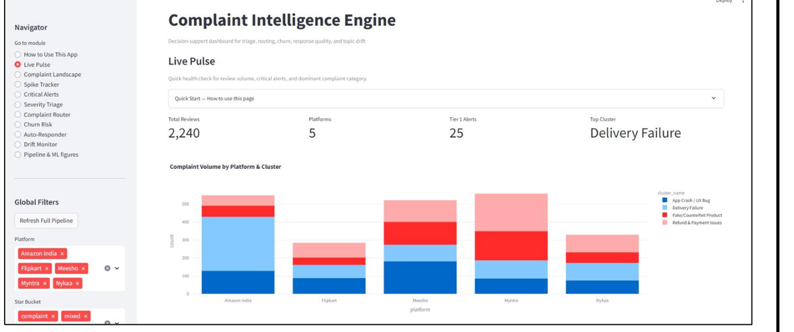
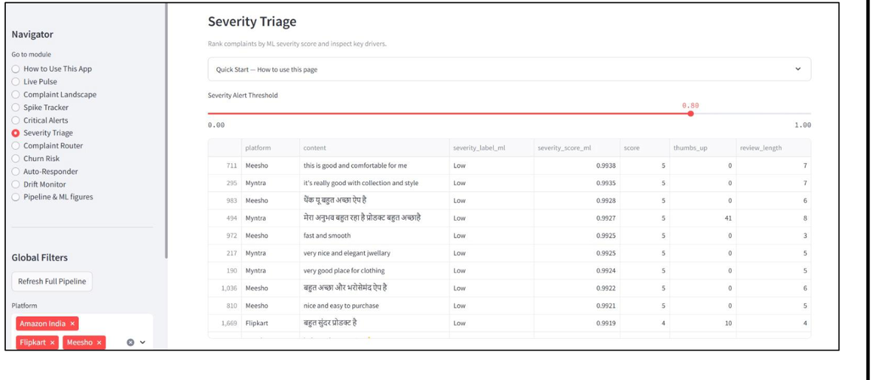
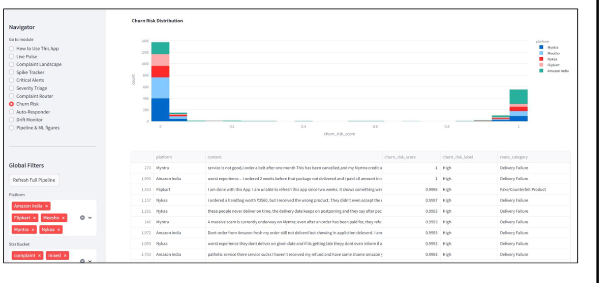
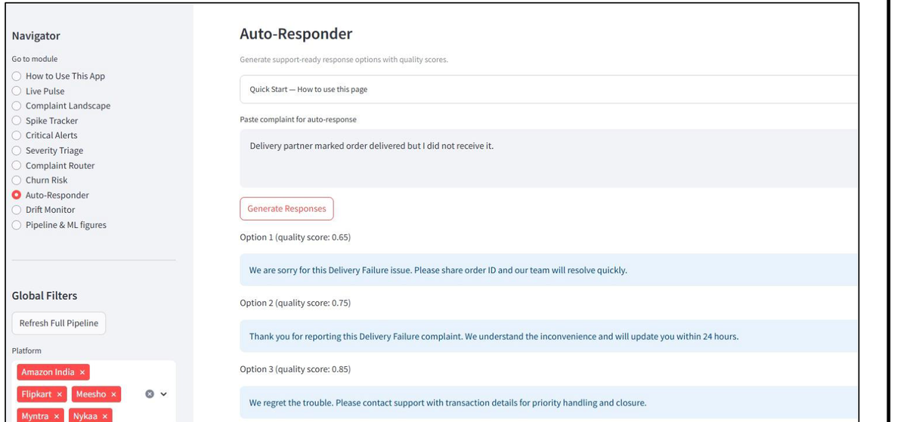
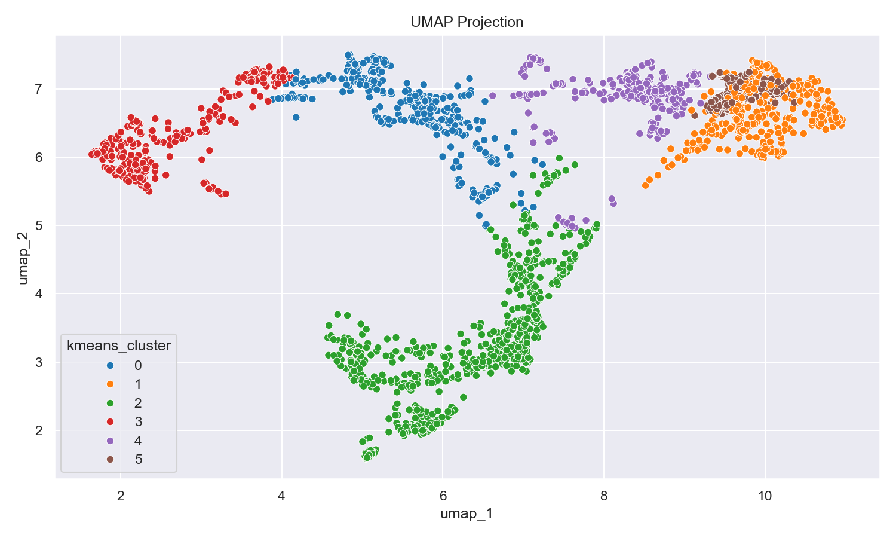
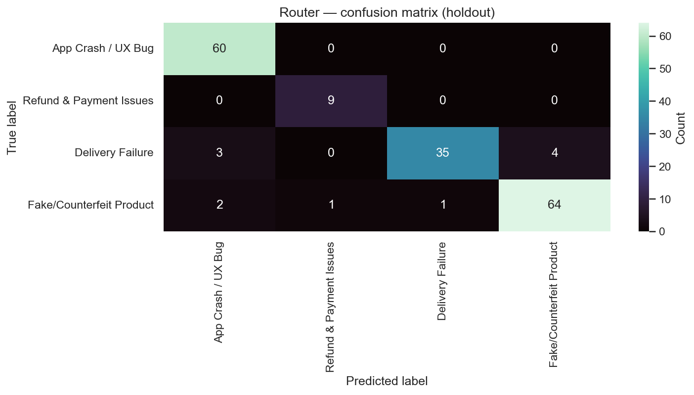

# Complaint Intelligence Engine

**An unsupervised NLP decision support system for Indian e-commerce complaint analytics.**

A twelve stage pipeline that turns raw multilingual reviews into an operations workflow: what is going wrong, how urgent it is, which team owns it, who is about to churn, what to reply, and what is newly emerging. One command produces every data artefact, trained model and evaluation report, plus a working Streamlit dashboard.

**Topics:** `nlp` `unsupervised-learning` `sentence-bert` `hinglish` `clustering` `hdbscan` `anomaly-detection` `streamlit` `ecommerce-analytics` `python`

---

## Why

Indian e-commerce platforms take in millions of reviews a year covering delivery failures, fake products, payment fraud, app crashes and return violations. Manual triage does not scale, and a large share of that text is Hinglish, which most pipelines drop or mangle. CIE keeps the Hinglish signal and does the triage automatically.

## Highlights

- **Hinglish native.** Multilingual Sentence-BERT maps English, Hindi and Romanised Hinglish into one 384 dimensional space, so reviews cluster by meaning regardless of script.
- **No manual labels.** The core layer discovers complaint archetypes with K-Means and HDBSCAN. The supervised layer is then trained on those discovered structures.
- **Dual flagged alerts.** A review is Tier 1 critical only if Isolation Forest ranks it in the top 5% and HDBSCAN calls it noise, which cuts false positives against either method alone.
- **Streamlit dashboard** for live filtering, spike tracking, routing and response drafting.

## Data

Live Google Play Store reviews via `google-play-scraper` (no API key) across Myntra, Meesho, Nykaa, Flipkart and Amazon India, in English and Hindi, country set to India. Reddit ingestion via PRAW is optional and needs credentials in `.env`.

| Stage | Count |
|---|---|
| Reviews fetched | 4,768 |
| After merge and clean | 2,389 |
| Final corpus after dedup | 2,253 |
| Hinglish reviews detected | 196 (~8.7%) |
| SBERT embeddings | (2,253, 384) |

## Pipeline

**Core NLP and unsupervised layer (01 to 07)**

| Step | What it does |
|---|---|
| 01 Ingest | Fetch, merge, dedup, drop reviews under 10 characters |
| 02 Preprocess | Light cleaning that preserves Hinglish, TF-IDF for cluster keywords |
| 03 Embed | `paraphrase-multilingual-MiniLM-L12-v2`, 384 dims, ~4 min on CPU |
| 04 Reduce | PCA 384d to 50d, UMAP 50d to 10d, t-SNE 2d for plots only |
| 05 Cluster | K-Means (k chosen by silhouette) and HDBSCAN on UMAP-10 |
| 06 Anomaly | Isolation Forest, One-Class SVM, rolling z-score spike detection at 2.5 sigma |
| 07 Visualise | Static PNG exports of volumes, spikes and cluster heatmaps |

**Supervised extension layer (08 to 12)**

| Step | What it does |
|---|---|
| 08 Severity | Escalation risk from weak labels built on legal and fraud keywords, rating and engagement |
| 09 Router | Routes to Delivery, Payments, Product Quality, App Issues or General, trained on high confidence K-Means assignments |
| 10 Churn | Churn risk proxy from complaint bucket, rating and review length, with balanced class weights |
| 11 Response | Three template variants per complaint, scored for empathy, specificity and actionability |
| 12 Drift | Weekly embedding centroid shift and Jensen-Shannon divergence to catch new complaint types |

## Results

From one documented run. Re-running on fresh reviews changes every figure.

| Task | Selected model | Metric | Score |
|---|---|---|---|
| Severity | Logistic Regression | Weighted F1 | 1.0 (CV 0.999) * |
| Router | LinearSVC on TF-IDF | Macro F1 | 0.936 (CV 0.933) |
| Churn | Gradient Boosting | PR-AUC | 1.0 (CV 0.997) * |
| Response | template_v3 | Mean quality | 0.590 |
| Drift | Weekly centroid + JS | Alert rate | 4 of 27 weeks |

Clustering: 4 data driven clusters, silhouette 0.12 to 0.25 (normal range for noisy real world review text), K-Means vs HDBSCAN ARI ~0.67, about 113 Tier 1 critical reviews, spike detection false positive rate ~1.2%.

\* The near perfect severity and churn scores come from weak label and feature alignment, not from genuine difficulty. Treat them as a sanity check on the labelling rules rather than as generalisation estimates.

## Dashboard

How to Use This App, Live Pulse, Complaint Landscape, Spike Tracker, Critical Alerts, Severity Triage, Complaint Router, Churn Risk, Auto-Responder, Drift Monitor, and Pipeline & ML figures. Global filters for platform, star bucket and date range, and a button that re-runs the full pipeline and clears cache.

A typical 15 minute ops review: spot a jump in Tier 1 alerts, confirm the spike is statistically real, read the top critical reviews, route one to the owning team, pull the high churn risk users behind it, draft a response, and check whether drift confirms a new sub-issue.

## Screenshots

<table>
<tr>
<td width="50%">

**Live Pulse**<br>KPI overview and complaint volume by platform and cluster


</td>
<td width="50%">

**Severity Triage**<br>Complaints ranked by ML severity score with an adjustable alert threshold


</td>
</tr>
<tr>
<td width="50%">

**Churn Risk**<br>Churn score distribution and the high-risk user watchlist


</td>
<td width="50%">

**Auto-Responder**<br>Generated reply options with quality scores for a pasted complaint


</td>
</tr>
<tr>
<td width="50%">

**UMAP cluster projection**<br>Discovered complaint archetypes in the reduced embedding space


</td>
<td width="50%">

**Router confusion matrix**<br>LinearSVC routing accuracy on a platform group holdout


</td>
</tr>
</table>

## Tech stack

Python, pandas, NumPy, SciPy, scikit-learn, sentence-transformers, PyTorch, langdetect, umap-learn, hdbscan, joblib, Streamlit, Plotly, matplotlib, seaborn, google-play-scraper, praw. Everything is open source and pip installable, and the core pipeline needs no paid keys.

## Setup

```bash
python -m venv .venv
source .venv/bin/activate        # Windows: .venv\Scripts\activate
pip install -r requirements.txt

python run_pipeline.py           # first run takes 8-12 min on CPU
streamlit run app.py
```

For Reddit ingestion, add `REDDIT_CLIENT_ID` and `REDDIT_CLIENT_SECRET` to a `.env` file. For Streamlit Community Cloud, set the same values as secrets.

## Limitations

Play Store reviews skew toward app experience rather than the full order journey. Hinglish detection is dictionary based and will miss unusual spellings. Weak labels encode the rules that wrote them, so the severity and churn scores above are not evidence of generalisation. Cluster count and all reported metrics shift with each fresh scrape.

## Team

Aditya Nariyapara (B009) and Devika Jonjale (B045)
Mentor: Dr. Rajesh Kumar Maurya
M.Sc. Data Science, NMIMS Mumbai, 2025-26
